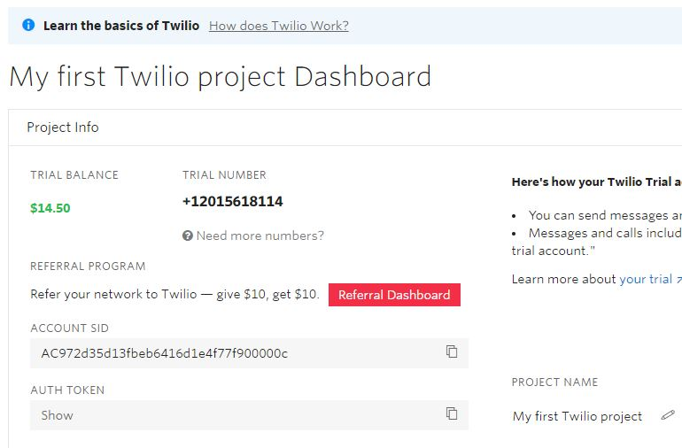

# springboot-twilio
- Open and change application.yml
```yml
twilio:
  account_sid: 
  auth_token: #your auth token
  trial_number: 
```
- Run the application
- Start sending sms's
# create twilio account by signing up

https://www.twilio.com/


